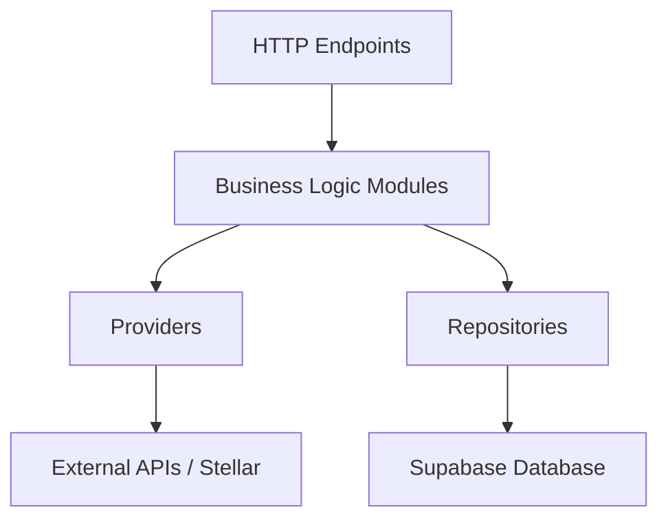

PayOnProof uses a **clean monorepo architecture** that separates frontend and backend concerns while maintaining a clear, scalable structure for cross-border remittance routing.

## Monorepo structure

The project is organized as a monorepo with two independent services:

```text
payonproof/
  services/
    web/                    # Frontend (Next.js)
    api/                    # Backend (Vercel Serverless)
```

### Service independence

Each service is:
- **Independently deployable** to Vercel
- **Self-contained** with its own dependencies and build process
- **Versioned separately** with distinct package.json files
- **Environment-isolated** with separate `.env` configurations

<Info>
The monorepo pattern allows shared development workflows while maintaining deployment independence. Each service can scale and evolve at its own pace.
</Info>

## Core architectural layers

The backend follows a **3-layer architecture** that enforces clear separation of concerns:



### Layer 1: HTTP endpoints

Location: `services/api/api/`

Serverless functions that handle HTTP requests and responses.

```typescript
// services/api/api/compare-routes.ts
export default async function handler(
  req: VercelRequest,
  res: VercelResponse
) {
  // 1. Parse and validate request
  const parsed = parseCompareRoutesInput(body);
  
  // 2. Call business logic
  const result = await compareRoutesWithAnchors(parsed.value);
  
  // 3. Return response
  return res.status(200).json(result);
}
```

**Responsibilities:**
- HTTP method validation
- Request body parsing and validation
- CORS handling
- Error response formatting
- Calling business logic modules

### Layer 2: Business logic modules

Location: `services/api/lib/remittances/compare/`, `services/api/lib/stellar/`

Domain logic that orchestrates providers and repositories.

```typescript
// services/api/lib/remittances/compare/service.ts
export async function compareRoutesWithAnchors(input: CompareRoutesInput) {
  // Fetch anchors from database
  const anchors = await getAnchorsForCorridor({
    origin: input.origin,
    destination: input.destination,
  });

  // Resolve capabilities from Stellar providers
  const runtimes = await Promise.all(
    anchors.map(resolveAnchorRuntime)
  );

  // Build and score routes
  const routes = buildRoutes(input, runtimes, exchangeRate);
  return { routes, meta };
}
```

**Responsibilities:**
- Coordinate multiple data sources
- Apply business rules (fee calculation, route scoring)
- Aggregate and transform data
- Handle domain-specific errors

### Layer 3: Providers and repositories

**Providers** (`services/api/lib/stellar/`): External integrations

```typescript
// services/api/lib/stellar/sep1.ts
export async function discoverAnchorFromDomain(input: Sep1DiscoveryInput) {
  const stellarTomlUrl = `https://${domain}/.well-known/stellar.toml`;
  const response = await fetchWithTimeout(stellarTomlUrl, timeout);
  const parsed = parseTomlFlat(await response.text());
  
  return {
    webAuthEndpoint: parsed.WEB_AUTH_ENDPOINT,
    transferServerSep24: parsed.TRANSFER_SERVER_SEP0024,
    // ...
  };
}
```

**Repositories** (`services/api/lib/repositories/`): Database access

```typescript
// services/api/lib/repositories/anchors-catalog.ts
export async function getAnchorsForCorridor(input: {
  origin: string;
  destination: string;
}): Promise<AnchorCatalogEntry[]> {
  const supabase = getSupabaseAdmin();
  
  const { data, error } = await supabase
    .from("anchors_catalog")
    .select("*")
    .eq("active", true)
    .in("country", [input.origin, input.destination]);

  return data.map(mapCatalogRow);
}
```

**Responsibilities:**
- Single-purpose data operations
- Protocol-specific logic (SEP-1, SEP-24, SEP-6)
- Error handling for external failures
- Data normalization and mapping

## Design principles

### 1. Unidirectional dependencies

```
Endpoints → Modules → Providers/Repositories
                    ↓               ↓
              External APIs      Database
```

- Endpoints never call providers/repositories directly
- Providers and repositories are **independent** of each other
- Business logic is centralized in modules

### 2. Fail-safe data access

The system gracefully degrades when Supabase is unavailable:

```typescript
export async function getAnchorsForCorridor(input) {
  try {
    // Try Supabase first
    const { data, error } = await supabase.from("anchors_catalog").select("*");
    if (error) throw error;
    return data;
  } catch {
    // Fallback to local JSON export
    return loadLocalFallbackAnchors();
  }
}
```

<Note>
Local fallback anchors are loaded from `services/api/data/anchors-export.json` when the database is unreachable.
</Note>

### 3. SEP-based capability discovery

Anchors are discovered and validated using Stellar SEP standards:

- **SEP-1** (stellar.toml): Discover anchor endpoints
- **SEP-10** (Auth): Web authentication endpoint
- **SEP-24** (Hosted Deposit/Withdrawal): Interactive flows
- **SEP-6** (Deposit/Withdrawal API): Programmatic flows
- **SEP-31** (Direct Payments): Cross-border payment rails

Capabilities are cached in the database and refreshed periodically.

### 4. Separation of secrets

**Backend secrets** (`services/api/.env`):
```bash
STELLAR_SIGNING_SECRET=S...
SUPABASE_SERVICE_ROLE_KEY=eyJ...
```

**Frontend public config** (`services/web/.env.local`):
```bash
NEXT_PUBLIC_API_BASE_URL=https://api.payonproof.com
```

<Info>
The frontend **never** accesses private keys, service-role tokens, or signs blockchain transactions. All sensitive operations occur in the backend.
</Info>

## Technology stack

### Frontend (`services/web`)
- **Framework**: Next.js 16 (App Router)
- **Language**: TypeScript
- **UI**: React 19 + Radix UI + Tailwind CSS
- **State**: React hooks (local state)
- **Wallet**: Freighter (Stellar wallet browser extension)

### Backend (`services/api`)
- **Runtime**: Node.js (Vercel Serverless)
- **Language**: TypeScript
- **Blockchain**: @stellar/stellar-sdk
- **Database**: Supabase (PostgreSQL)
- **Deployment**: Vercel Functions

### Infrastructure
- **Hosting**: Vercel (both services)
- **Database**: Supabase
- **Blockchain**: Stellar Network (Mainnet/Testnet)
- **Anchor Discovery**: stellar.toml (SEP-1)

## Key architectural decisions

### Why monorepo?
- **Shared development experience**: Consistent tooling and workflows
- **Type safety across services**: Shared TypeScript types
- **Simplified local development**: Run both services with two terminal commands
- **Independent deployment**: Each service deploys separately to Vercel

### Why serverless?
- **Zero infrastructure management**: Vercel handles scaling and availability
- **Cost-efficient**: Pay only for actual request processing
- **Global edge deployment**: Low latency for international users
- **Automatic HTTPS and CDN**: Built-in performance optimization

### Why Stellar?
- **Low transaction costs**: Fractions of a cent per transaction
- **Fast settlement**: 3-5 second finality
- **Built-in DEX**: Decentralized asset exchange
- **Anchor ecosystem**: Fiat on/off-ramps via SEP standards
- **Regulatory-friendly**: KYC/AML handled by regulated anchors

## Next steps

<CardGroup cols={2}>
  <Card title="Frontend architecture" icon="window" href="/architecture/frontend">
    Learn about the Next.js app structure and component design
  </Card>
  <Card title="Backend architecture" icon="server" href="/architecture/backend">
    Deep dive into API endpoints, modules, and data flow
  </Card>
  <Card title="Stellar integration" icon="link" href="/architecture/stellar-integration">
    Understand how PayOnProof integrates with Stellar anchors
  </Card>
</CardGroup>