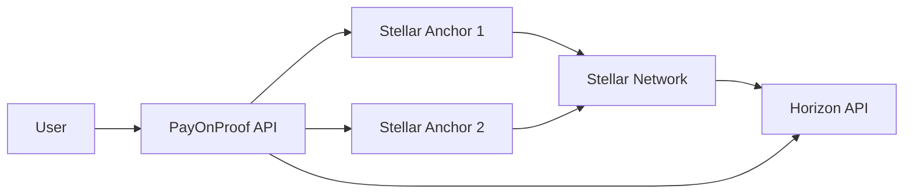

PayOnProof uses the **Stellar Network** as settlement infrastructure and integrates with **Stellar anchors** (regulated fiat on/off-ramps) through standardized SEP protocols.

## Why Stellar?

PayOnProof chose Stellar for cross-border remittances because:

- **Low transaction costs**: ~$0.00001 per transaction
- **Fast settlement**: 3-5 second finality
- **Built-in multi-currency support**: Native asset issuance and pathfinding
- **Anchor ecosystem**: Regulated fiat gateways in 100+ countries
- **SEP standards**: Interoperable protocols for deposits, withdrawals, and auth
- **Regulatory compatibility**: Anchors handle KYC/AML compliance

<Info>
Stellar is purpose-built for cross-border payments. Unlike general-purpose blockchains, it optimizes for speed, low cost, and regulatory compliance.
</Info>

## Stellar architecture in PayOnProof



1. User initiates transfer through PayOnProof UI
2. API discovers anchors via SEP-1 (stellar.toml)
3. API validates anchor capabilities via SEP-24/SEP-6 endpoints
4. User authenticates with anchor via SEP-10 (Stellar Web Auth)
5. User initiates deposit/withdrawal via SEP-24 (interactive flow)
6. Transaction settles on Stellar Network
7. API queries Horizon for confirmation
8. Proof of payment generated with transaction hash

## Stellar Ecosystem Protocols (SEPs)

PayOnProof implements multiple SEP standards:

### SEP-1: Stellar Info File (stellar.toml)

**Purpose**: Discover anchor metadata and service endpoints.

**Implementation**: `lib/stellar/sep1.ts`

```typescript
export async function discoverAnchorFromDomain(
  input: Sep1DiscoveryInput
): Promise<Sep1DiscoveryResult> {
  const stellarTomlUrl = `https://${domain}/.well-known/stellar.toml`;
  const response = await fetchWithTimeout(stellarTomlUrl, timeout);
  const text = await response.text();
  const parsed = parseTomlFlat(text);

  return {
    domain,
    stellarTomlUrl,
    signingKey: parsed.SIGNING_KEY,
    webAuthEndpoint: parsed.WEB_AUTH_ENDPOINT,
    transferServerSep24: parsed.TRANSFER_SERVER_SEP0024,
    transferServerSep6: parsed.TRANSFER_SERVER,
    directPaymentServer: parsed.DIRECT_PAYMENT_SERVER,
    kycServer: parsed.KYC_SERVER,
  };
}
```

**Example stellar.toml:**
```toml
VERSION="2.0.0"
NETWORK_PASSPHRASE="Public Global Stellar Network ; September 2015"

[[CURRENCIES]]
code="USDC"
issuer="GA5ZSEJYB37JRC5AVCIA5MOP4RHTM335X2KGX3IHOJAPP5RE34K4KZVN"

SIGNING_KEY="GCXYZ..."
WEB_AUTH_ENDPOINT="https://anchor.example.com/auth"
TRANSFER_SERVER_SEP0024="https://anchor.example.com/sep24"
DIRECT_PAYMENT_SERVER="https://anchor.example.com/sep31"
```

<Note>
SEP-1 is the entry point for all anchor discovery. Every operational anchor must host a `stellar.toml` file at `/.well-known/stellar.toml`.
</Note>

### SEP-10: Stellar Web Authentication

**Purpose**: Authenticate users with anchors using Stellar keypairs.

**Flow:**
1. Client requests challenge from anchor's `WEB_AUTH_ENDPOINT`
2. Anchor returns unsigned transaction challenge
3. User signs challenge with Stellar keypair (via Freighter wallet)
4. Client submits signed challenge
5. Anchor validates signature and returns JWT token

**Implementation**: `lib/stellar/sep10.ts`

```typescript
export async function getSep10Challenge(input: {
  webAuthEndpoint: string;
  accountId: string;
  homeDomain: string;
}): Promise<{ transaction: string; networkPassphrase: string }> {
  const url = `${input.webAuthEndpoint}?account=${input.accountId}&home_domain=${input.homeDomain}`;
  const response = await fetch(url);
  const data = await response.json();
  
  return {
    transaction: data.transaction,
    networkPassphrase: data.network_passphrase,
  };
}

export async function submitSep10Challenge(input: {
  webAuthEndpoint: string;
  signedTransaction: string;
}): Promise<{ token: string }> {
  const response = await fetch(input.webAuthEndpoint, {
    method: "POST",
    headers: { "Content-Type": "application/json" },
    body: JSON.stringify({ transaction: input.signedTransaction }),
  });
  
  return response.json();
}
```

**JWT token usage:**
```typescript
// All subsequent anchor API calls use the JWT
const headers = {
  "Authorization": `Bearer ${jwtToken}`,
  "Content-Type": "application/json",
};
```

### SEP-24: Hosted Deposit and Withdrawal

**Purpose**: Interactive deposit/withdrawal flows with KYC/AML compliance.

**Implementation**: `lib/stellar/sep24.ts`

```typescript
export async function fetchSep24Info(input: Sep24InfoInput) {
  const infoUrl = `${input.transferServerSep24}/info`;
  const response = await fetchWithTimeout(infoUrl, timeout);
  const info = await response.json();
  
  return {
    infoUrl,
    transferServerSep24: input.transferServerSep24,
    info, // Contains supported assets, fees, limits
  };
}
```

**Example `/info` response:**
```json
{
  "deposit": {
    "USDC": {
      "enabled": true,
      "fee_fixed": 0,
      "fee_percent": 0.1,
      "min_amount": 10,
      "max_amount": 100000
    }
  },
  "withdraw": {
    "USDC": {
      "enabled": true,
      "fee_fixed": 5,
      "fee_percent": 0.5,
      "min_amount": 10,
      "max_amount": 50000
    }
  }
}
```

**Interactive deposit flow:**

```typescript
// 1. Get deposit URL
const depositResponse = await fetch(`${transferServer}/transactions/deposit/interactive`, {
  method: "POST",
  headers: { Authorization: `Bearer ${jwtToken}` },
  body: JSON.stringify({
    asset_code: "USDC",
    account: userStellarAddress,
    amount: "1000",
  }),
});

const { url, id } = await depositResponse.json();

// 2. User completes KYC/payment in popup
window.open(url, "_blank", "width=500,height=700");

// 3. Poll transaction status
const statusResponse = await fetch(`${transferServer}/transaction?id=${id}`, {
  headers: { Authorization: `Bearer ${jwtToken}` },
});

const { status } = await statusResponse.json();
// status: "pending_user_transfer_start" | "completed" | "error"
```

### SEP-6: Deposit and Withdrawal API

**Purpose**: Programmatic deposits/withdrawals without interactive UI.

**Implementation**: `lib/stellar/sep6.ts`

```typescript
export async function fetchSep6Info(input: Sep6InfoInput) {
  const infoUrl = `${input.transferServerSep6}/info`;
  const response = await fetchWithTimeout(infoUrl, timeout);
  const info = await response.json();
  
  return { infoUrl, transferServerSep6: input.transferServerSep6, info };
}
```

**Difference from SEP-24:**
- SEP-24: Interactive (popup/iframe for KYC)
- SEP-6: Programmatic (API-only, pre-verified users)

PayOnProof prefers SEP-24 for MVP because it handles KYC flows automatically.

### SEP-31: Cross-Border Payments API

**Purpose**: Direct payment protocol for remittances.

**Flow:**
1. Sender's anchor receives fiat
2. Sender's anchor sends USDC to recipient's anchor
3. Recipient's anchor disburses local fiat

**Discovery:**
```typescript
const sep1 = await discoverAnchorFromDomain({ domain: "anchor.example.com" });
if (sep1.directPaymentServer) {
  // Anchor supports SEP-31 direct payments
  console.log("SEP-31 endpoint:", sep1.directPaymentServer);
}
```

PayOnProof uses SEP-31 as a **scoring signal** (routes with SEP-31 support get higher scores) but doesn't implement the full protocol in MVP.

## Stellar Network configuration

### Network selection

PayOnProof supports both Testnet (staging) and Mainnet (production):

```typescript
// lib/stellar.ts
export function getStellarConfig() {
  const popEnv = getPopEnv();
  
  const defaultHorizonUrl = popEnv === "production"
    ? "https://horizon.stellar.org"
    : "https://horizon-testnet.stellar.org";
    
  const defaultPassphrase = popEnv === "production"
    ? "Public Global Stellar Network ; September 2015"
    : "Test SDF Network ; September 2015";

  return {
    popEnv,
    horizonUrl: process.env.STELLAR_HORIZON_URL ?? defaultHorizonUrl,
    networkPassphrase: process.env.STELLAR_NETWORK_PASSPHRASE ?? defaultPassphrase,
  };
}
```

**Environment detection:**
```typescript
export function getPopEnv(): PopEnv {
  // Explicit override
  if (process.env.POP_ENV === "production") return "production";
  if (process.env.POP_ENV === "staging") return "staging";
  
  // Infer from network passphrase
  if (process.env.STELLAR_NETWORK_PASSPHRASE === "Test SDF Network ; September 2015") {
    return "staging";
  }
  
  return "production";
}
```

### Horizon API client

```typescript
import { Horizon } from "@stellar/stellar-sdk";

export function getHorizonServer() {
  const { horizonUrl } = getStellarConfig();
  return new Horizon.Server(horizonUrl);
}

export async function getLatestLedgerSequence() {
  const server = getHorizonServer();
  const ledgers = await server.ledgers().order("desc").limit(1).call();
  return Number(ledgers.records[0].sequence);
}
```

## Anchor catalog management

### Discovery and import

PayOnProof maintains a catalog of Stellar anchors in Supabase:

**Automatic sync (cron):**
```bash
# Runs every 15 minutes via Vercel Cron
GET /api/cron/anchors-sync
```

**Discovery modes:**

1. **Horizon discovery** (recommended):
   - Query Horizon for asset issuers with `home_domain`
   - Validate each domain's `stellar.toml`
   - Extract SEP endpoints and capabilities
   - Insert/update `anchors_catalog` table

2. **Manual seed import**:
   ```bash
   npm run anchors:seed:import -- --file ./anchor-seeds.json --apply
   ```

**Seed file format:**
```json
{
  "anchors": [
    {
      "name": "MoneyGram Access",
      "domain": "moneygram.stellar.org",
      "countries": ["US", "MX", "PH"],
      "currencies": ["USDC"],
      "type": "on-ramp",
      "active": true
    }
  ]
}
```

### Capability refresh

Anchors are periodically validated:

```typescript
const CAPABILITY_REFRESH_MS = 10 * 60 * 1000; // 10 minutes

async function resolveAnchorRuntime(anchor: AnchorCatalogEntry) {
  const shouldRefresh = Date.now() - lastCheckedAtMs > CAPABILITY_REFRESH_MS;
  
  if (!shouldRefresh) {
    return anchor.capabilities; // Use cache
  }
  
  // Refresh from stellar.toml and SEP endpoints
  const resolved = await resolveAnchorCapabilities({
    domain: anchor.domain,
    assetCode: anchor.currency,
  });
  
  // Update database
  await updateAnchorCapabilities({
    id: anchor.id,
    ...resolved.sep,
    ...resolved.endpoints,
    operational: isOperational(resolved),
    lastCheckedAt: new Date().toISOString(),
  });
  
  return resolved;
}
```

**Operational status criteria:**
```typescript
const operational = Boolean(
  resolved.sep.sep10 &&           // Has auth endpoint
  resolved.sep.sep24 &&           // Has SEP-24 server
  resolved.endpoints.webAuthEndpoint &&
  resolved.endpoints.transferServerSep24 &&
  sep24AssetSupported             // Asset is in /info response
);
```

## Transaction flow example

End-to-end flow for a US → Mexico remittance:

### 1. Route discovery

```bash
POST /api/compare-routes
{
  "origin": "US",
  "destination": "MX",
  "amount": 1000
}
```

**Backend logic:**
```typescript
// Get anchors from catalog
const anchors = await getAnchorsForCorridor({ origin: "US", destination: "MX" });

// Resolve capabilities from stellar.toml + SEP endpoints
const runtimes = await Promise.all(anchors.map(resolveAnchorRuntime));

// Filter operational anchors
const originAnchors = runtimes.filter(r => r.catalog.type === "on-ramp" && r.operational);
const destinationAnchors = runtimes.filter(r => r.catalog.type === "off-ramp" && r.operational);

// Build route matrix
const routes = [];
for (const origin of originAnchors) {
  for (const dest of destinationAnchors) {
    routes.push(buildRoute(input, origin, dest, exchangeRate));
  }
}

return scoreRoutes(routes);
```

### 2. User selects route

Frontend displays routes, user clicks "Select" on best route.

### 3. SEP-10 authentication

```typescript
// Request challenge
const { transaction, networkPassphrase } = await getSep10Challenge({
  webAuthEndpoint: route.originAnchor.webAuthEndpoint,
  accountId: userPublicKey,
  homeDomain: route.originAnchor.domain,
});

// User signs with Freighter wallet
const signedTx = await window.freighterApi.signTransaction(transaction, {
  networkPassphrase,
});

// Submit signed challenge
const { token } = await submitSep10Challenge({
  webAuthEndpoint: route.originAnchor.webAuthEndpoint,
  signedTransaction: signedTx,
});
```

### 4. SEP-24 deposit

```typescript
// Get interactive deposit URL
const response = await fetch(`${transferServer}/transactions/deposit/interactive`, {
  method: "POST",
  headers: { Authorization: `Bearer ${token}` },
  body: JSON.stringify({
    asset_code: "USDC",
    account: userPublicKey,
    amount: "1000",
  }),
});

const { url, id } = await response.json();

// Open popup for KYC/payment
const popup = window.open(url, "sep24", "width=500,height=700");

// Poll for completion
const interval = setInterval(async () => {
  const status = await fetch(`${transferServer}/transaction?id=${id}`, {
    headers: { Authorization: `Bearer ${token}` },
  }).then(r => r.json());
  
  if (status.status === "completed") {
    clearInterval(interval);
    popup.close();
    showProofOfPayment(status.stellar_transaction_id);
  }
}, 2000);
```

### 5. Proof of payment

```typescript
const stellarExpertUrl = `https://stellar.expert/explorer/public/tx/${stellarTxHash}`;

<a href={stellarExpertUrl} target="_blank">
  View transaction on StellarExpert
</a>
```

## Fee structure

### On-chain fees (Stellar Network)

- **Base fee**: 100 stroops (~$0.00001 USD)
- **Network congestion**: Can increase to 1000 stroops (~$0.0001)

PayOnProof pays network fees from operational account.

### Anchor fees

Extracted from SEP-24/SEP-6 `/info` endpoints:

```typescript
function extractFeeFromInfo(info: unknown, assetCode: string) {
  const deposit = info.deposit[assetCode];
  return {
    fixed: deposit.fee_fixed,     // Fixed fee in asset units
    percent: deposit.fee_percent, // Percentage fee (e.g., 0.5 = 0.5%)
  };
}
```

**Fee calculation:**
```typescript
const onRampFee = originAnchor.fees.percent; // e.g., 0.2%
const offRampFee = destinationAnchor.fees.percent; // e.g., 1.0%
const bridgeFee = 0.2; // PayOnProof fee

const totalFeePercent = onRampFee + bridgeFee + offRampFee; // 1.4%
const feeAmount = amount * (totalFeePercent / 100);
const receivedAmount = (amount - feeAmount) * exchangeRate;
```

## Security considerations

### Private key management

<Note>
PayOnProof **never** stores user private keys. All transaction signing occurs in the user's browser via Freighter wallet.
</Note>

**Backend signing secret:**
```bash
# Only used for operational transactions (anchor catalog refresh, etc.)
STELLAR_SIGNING_SECRET=S...
```

Stored in Vercel environment variables, never exposed to frontend.

### Anchor validation

Before calling any anchor endpoint:

1. **Verify stellar.toml HTTPS**: Must be served over HTTPS
2. **Validate TOML signature**: Check `SIGNING_KEY` matches expected value
3. **Allowlist domains**: Only interact with anchors in catalog
4. **Rate limiting**: Prevent abuse of anchor APIs
5. **Timeout enforcement**: 8-second timeout on all anchor requests

### Transaction verification

After transaction submission:

```typescript
const server = getHorizonServer();
const tx = await server.transactions().transaction(txHash).call();

if (!tx.successful) {
  throw new Error("Transaction failed on Stellar");
}

// Verify memo matches expected value
if (tx.memo !== expectedMemo) {
  throw new Error("Memo mismatch");
}
```

## Production checklist

- [ ] Switch to Mainnet Horizon URL
- [ ] Update `STELLAR_NETWORK_PASSPHRASE` to production value
- [ ] Rotate `STELLAR_SIGNING_SECRET` (generate new keypair)
- [ ] Fund operational account with XLM for fees
- [ ] Set up anchor catalog sync cron job
- [ ] Configure allowed anchor domains allowlist
- [ ] Enable Horizon request logging
- [ ] Set up StellarExpert monitoring for operational account
- [ ] Test SEP-10 auth with production anchors
- [ ] Verify SEP-24 flows in production environment

## Next steps

<CardGroup cols={2}>
  <Card title="Architecture overview" icon="diagram-project" href="/architecture/overview">
    Review the full system architecture
  </Card>
  <Card title="API reference" icon="code" href="/api/overview">
    Explore API endpoints and request/response formats
  </Card>
</CardGroup>