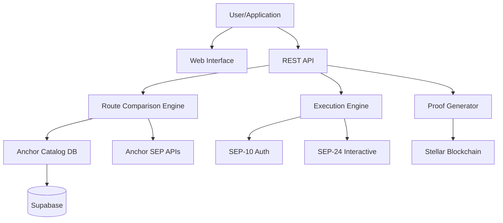
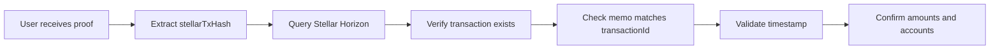
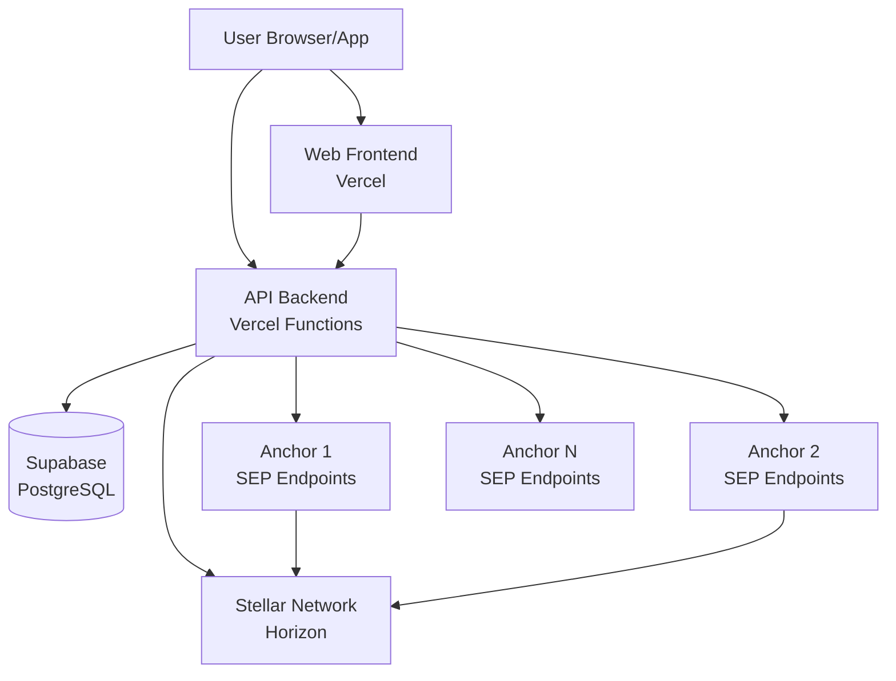

## Architecture overview

PayOnProof is built on a multi-layer architecture that separates concerns between discovery, routing, execution, and verification.



### Components

<CardGroup cols={2}>
  <Card title="Frontend (Web)" icon="browser">
    Next.js application providing user interface for route comparison, wallet connection, and transaction monitoring.
  </Card>
  <Card title="API (Orchestrator)" icon="server">
    Vercel serverless functions handling route discovery, anchor aggregation, and execution coordination.
  </Card>
  <Card title="Anchor Catalog" icon="database">
    Supabase-backed database storing anchor metadata, capabilities, and operational status.
  </Card>
  <Card title="Stellar Network" icon="link">
    Blockchain layer providing transaction settlement and verifiable proof of payment.
  </Card>
</CardGroup>

## Payment flow (end-to-end)

Here's how a payment moves through PayOnProof:

<Steps>
  <Step title="User initiates payment">
    User specifies origin country, destination country, and amount via web interface or API.
  </Step>
  <Step title="Route discovery">
    PayOnProof queries the anchor catalog for operational anchors in the corridor and fetches live SEP capabilities.
  </Step>
  <Step title="Route comparison">
    System builds all possible origin-destination anchor pairs, calculates fees and exchange rates, and scores routes.
  </Step>
  <Step title="Route selection">
    User selects a route (manually or via auto-recommendation) and initiates execution.
  </Step>
  <Step title="Authentication (SEP-10)">
    PayOnProof fetches SEP-10 challenges from both anchors, user's wallet signs challenges, and API exchanges signatures for JWT tokens.
  </Step>
  <Step title="Interactive flows (SEP-24)">
    API initiates deposit flow at origin anchor and withdraw flow at destination anchor. User completes KYC and transfer details in anchor-provided interfaces.
  </Step>
  <Step title="Settlement">
    Anchors settle the payment on Stellar network. Transaction hash is recorded on-chain.
  </Step>
  <Step title="Proof generation">
    PayOnProof generates verifiable proof containing transaction hash, anchors used, fees, amounts, and timestamp.
  </Step>
</Steps>

## Anchor discovery and cataloging

PayOnProof maintains a live catalog of Stellar anchors and their capabilities.

### Discovery mechanisms

#### 1. Horizon-based discovery

The recommended production approach queries Stellar Horizon for asset issuers:

```typescript
// From services/api/lib/stellar/horizon.ts
// Discovers anchors by:
// 1. Fetching all assets from Horizon
// 2. Extracting issuer home_domain from accounts
// 3. Validating stellar.toml files
// 4. Discovering SEP endpoints
```

<Note>
  This approach scales to 600+ anchors and auto-discovers new issuers as they join the network.
</Note>

#### 2. Directory-based import

For bootstrapping or fallback, import from anchor directories:

```bash
cd services/api
npm run anchors:bootstrap -- --download-url "https://source.json"
```

#### 3. Seed file import

Manually curated anchor list for production control:

```json
// scripts/anchor-seeds.json
[
  {
    "domain": "stellar.moneygram.com",
    "name": "MoneyGram",
    "country": "US",
    "currency": "USD",
    "type": "on-ramp"
  }
]
```

```bash
npm run anchors:seed:import -- --file ./anchor-seeds.json --apply
```

### Capability resolution

For each anchor, PayOnProof resolves:

```typescript
// From services/api/lib/stellar/capabilities.ts
export async function resolveAnchorCapabilities({
  domain,
  assetCode
}: {
  domain: string;
  assetCode: string;
}) {
  // 1. Fetch stellar.toml (SEP-1)
  const toml = await fetchStellarToml(domain);
  
  // 2. Extract endpoints
  const webAuthEndpoint = toml.WEB_AUTH_ENDPOINT; // SEP-10
  const transferServerSep24 = toml.TRANSFER_SERVER_SEP0024; // SEP-24
  const transferServerSep6 = toml.TRANSFER_SERVER; // SEP-6
  const directPaymentServer = toml.DIRECT_PAYMENT_SERVER; // SEP-31
  
  // 3. Query /info endpoints for asset support
  const sep24Info = await fetchSep24Info(transferServerSep24);
  
  // 4. Validate operational status
  const operational = Boolean(
    webAuthEndpoint &&
    transferServerSep24 &&
    assetSupported(sep24Info, assetCode)
  );
  
  return { sep, endpoints, operational, diagnostics };
}
```

### Automatic refresh

Capabilities are refreshed automatically:

- **On route comparison**: If cache is older than 10 minutes
- **Via cron endpoint**: Every 15 minutes on production
- **Manual trigger**: `POST /api/anchors/capabilities/refresh`

```bash
# Vercel cron configuration (services/api/vercel.json)
{
  "crons": [
    {
      "path": "/api/cron/anchors-sync",
      "schedule": "*/15 * * * *"
    }
  ]
}
```

## Route comparison engine

The core of PayOnProof is the route comparison engine.

### Route building

```typescript
// From services/api/lib/remittances/compare/service.ts:291-356
export async function compareRoutesWithAnchors(input: CompareRoutesInput) {
  // 1. Get anchors for corridor
  const anchors = await getAnchorsForCorridor({
    origin: input.origin,
    destination: input.destination
  });
  
  // 2. Resolve runtime capabilities
  const runtimes = await Promise.all(
    anchors.map(resolveAnchorRuntime)
  );
  
  // 3. Filter operational anchors
  const originAnchors = runtimes.filter(
    r => r.catalog.type === 'on-ramp' && r.operational
  );
  const destinationAnchors = runtimes.filter(
    r => r.catalog.type === 'off-ramp' && r.operational
  );
  
  // 4. Get live FX rate
  const exchangeRate = await getFxRate(
    originCurrency,
    destinationCurrency
  );
  
  // 5. Build all possible routes (cartesian product)
  const routes = [];
  for (const origin of originAnchors) {
    for (const destination of destinationAnchors) {
      routes.push(
        buildRoute(input, origin, destination, exchangeRate)
      );
    }
  }
  
  // 6. Score and rank routes
  const scored = scoreRoutes(routes);
  
  return { routes: scored, meta: { ... } };
}
```

### Fee calculation

```typescript
// From services/api/lib/remittances/compare/service.ts:211-289
function buildRoute(
  input: CompareRoutesInput,
  originAnchor: AnchorRuntime,
  destinationAnchor: AnchorRuntime,
  exchangeRate: number
): RemittanceRoute {
  // Resolve fees from anchor capabilities or fallback
  const onRampPercent = resolveFeePercent(originAnchor.fees, input.amount);
  const offRampPercent = resolveFeePercent(destinationAnchor.fees, input.amount);
  const bridgeFeePercent = 0.2; // PayOnProof fee
  
  // Calculate total fees
  const totalPercent = onRampPercent + bridgeFeePercent + offRampPercent;
  const feeAmount = input.amount * (totalPercent / 100);
  const receivedAmount = (input.amount - feeAmount) * exchangeRate;
  
  return {
    id: `route-${originAnchor.id}-${destinationAnchor.id}`,
    feePercentage: totalPercent,
    feeAmount,
    feeBreakdown: {
      onRamp: onRampPercent,
      bridge: bridgeFeePercent,
      offRamp: offRampPercent
    },
    exchangeRate,
    receivedAmount,
    estimatedMinutes: calculateEstimate(originAnchor, destinationAnchor),
    available: originAnchor.operational && destinationAnchor.operational
  };
}
```

### Route scoring

Routes are scored based on multiple factors:

```typescript
// From services/api/lib/remittances/compare/scoring.ts
export function scoreRoutes(routes: RemittanceRoute[]): RemittanceRoute[] {
  return routes
    .map(route => {
      let score = 100;
      
      // Penalize higher fees (0-40 points)
      score -= route.feePercentage * 10;
      
      // Reward faster settlement (0-20 points)
      score += (30 - route.estimatedMinutes) / 2;
      
      // Penalize operational risks (0-20 points)
      score -= route.risks.length * 5;
      
      // Bonus for escrow protection (10 points)
      if (route.escrow) score += 10;
      
      // Bonus for both anchors having SEP-24 (15 points)
      if (hasBothSep24(route)) score += 15;
      
      return { ...route, score: Math.max(0, score) };
    })
    .sort((a, b) => b.score - a.score)
    .map((route, i) => ({
      ...route,
      recommended: i === 0 // Top-scored route
    }));
}
```

## Transfer execution flow

PayOnProof uses a multi-phase execution model to handle the complex SEP-10/SEP-24 authentication and interactive flows.

### Phase 1: Prepare

```typescript
// From services/api/api/execute-transfer.ts:960-1074
POST /api/execute-transfer
{
  "phase": "prepare",
  "route": { /* selected route */ },
  "amount": 1000,
  "senderAccount": "GXXX..."
}
```

**Backend process:**

1. Validate route is operational
2. Resolve final anchor domains (handle MoneyGram test environment mapping)
3. Fetch fresh SEP capabilities for both anchors
4. Request SEP-10 challenges from both anchors
5. Return unsigned challenges to client

```typescript
// services/api/api/execute-transfer.ts:901-909
const challenge = await fetchSep10Challenge({
  webAuthEndpoint,
  account: senderAccount,
  memo: moneyGramMemo, // MoneyGram requires integer user ID
  homeDomain: clientDomain,
  clientDomain: clientDomain
});
```

<Note>
  Client domain signing is required for certain anchors (e.g., MoneyGram). PayOnProof automatically handles this server-side.
</Note>

### Phase 2: Authorize

```typescript
POST /api/execute-transfer
{
  "phase": "authorize",
  "prepared": { /* from phase 1 */ },
  "signatures": {
    "origin": "signed_challenge_xdr",
    "destination": "signed_challenge_xdr"
  }
}
```

**Backend process:**

1. Apply client domain signatures (if required)
2. Exchange signed challenges for SEP-10 JWT tokens
3. Start SEP-24 interactive flows (deposit + withdraw)
4. Return interactive URLs and encrypted status handle

```typescript
// services/api/api/execute-transfer.ts:1174-1201
const signedWithClientDomain = signClientDomainChallenge({
  transactionXdr: userSignedChallenge,
  networkPassphrase,
  anchorDomain
});

const token = await exchangeSep10Token({
  webAuthEndpoint,
  signedChallengeXdr: signedWithClientDomain
});

const interactive = await startSep24Interactive({
  transferServerSep24,
  token,
  operation: role === 'origin' ? 'deposit' : 'withdraw',
  assetCode,
  amount,
  callbackUrl
});
```

### Phase 3: Status polling

```typescript
POST /api/execute-transfer
{
  "phase": "status",
  "transactionId": "POP-1234567890-X7Y9Z2",
  "statusRef": "encrypted_handle"
}
```

**Backend process:**

1. Decrypt status handle (contains JWT tokens and interactive IDs)
2. Check for anchor callback completion
3. Poll SEP-24 transaction status for both anchors
4. Extract Stellar transaction hash when available
5. Return aggregated status

```typescript
// services/api/api/execute-transfer.ts:1077-1147
const state = decryptStatusRef(statusRef);

// Check callback first (faster than polling)
const callbackEvent = await getAnchorCallbackEvent({
  transactionId,
  callbackToken: state.callbackToken
});
if (callbackEvent?.stellarTxHash) {
  return { completed: true, stellarTxHash: callbackEvent.stellarTxHash };
}

// Poll anchor status endpoints
const results = await Promise.all(
  state.anchors.map(handle => 
    fetchSep24TransactionStatus(handle)
  )
);
```

<Warning>
  Status handles are encrypted with `EXECUTION_STATE_SECRET` to prevent exposing anchor JWT tokens to the frontend.
</Warning>

## Anchor callback handling

PayOnProof supports SEP-24 callbacks for faster completion detection:

```typescript
// services/api/api/anchors/sep24/callback.ts
GET /api/anchors/sep24/callback?transactionId=POP-XXX&callbackToken=YYY&secret=ZZZ
```

When an anchor completes a transaction, it calls this endpoint with status updates. PayOnProof:

1. Validates callback secret
2. Records the event in the database
3. Returns 200 OK to the anchor

The status polling phase checks this table first, avoiding unnecessary API calls to anchors.

## Proof of payment generation

Once a transfer completes, PayOnProof generates a verifiable proof.

### Proof structure

```typescript
interface ProofOfPayment {
  transactionId: string;        // PayOnProof internal ID
  stellarTxHash: string;        // On-chain transaction hash
  timestamp: string;            // ISO 8601 completion time
  amount: number;               // Original amount sent
  originCurrency: string;       // Origin currency code
  destinationCurrency: string;  // Destination currency code
  receivedAmount: number;       // Final amount received
  feeAmount: number;            // Total fees paid
  feePercentage: number;        // Total fee percentage
  route: {
    originAnchor: string;       // Origin anchor name
    destinationAnchor: string;  // Destination anchor name
  };
  verificationUrl: string;      // Blockchain explorer link
  status: 'completed' | 'pending' | 'failed';
}
```

### On-chain verification

The Stellar transaction hash (`stellarTxHash`) provides cryptographic proof:

- **Immutable**: Cannot be altered once on-chain
- **Timestamped**: Ledger close time is consensus-verified
- **Transparent**: Anyone can verify via Stellar explorers
- **Permanent**: Stored on distributed ledger indefinitely

Verification flow:



<Note>
  PayOnProof embeds the transaction ID in the Stellar memo field for correlation.
</Note>

## Data storage and privacy

### On-chain (Stellar blockchain)

Publicly visible:
- Transaction hash
- Source and destination accounts
- Amount transferred
- Ledger close timestamp
- Transaction memo (PayOnProof transaction ID)

### Off-chain (PayOnProof database)

Privately stored in Supabase:
- User account associations
- Route selection history
- Anchor callback events
- Transaction metadata
- Savings analytics

<Warning>
  PayOnProof does NOT store:
  - Private keys or wallet seeds
  - Sensitive personal information (handled by anchors)
  - Payment credentials or bank details
</Warning>

### Row-level security

All Supabase tables use RLS policies:

```sql
-- Example: Only service role can write anchor catalog
CREATE POLICY "Service role can insert anchors"
  ON anchors_catalog
  FOR INSERT
  TO service_role
  USING (true);
```

## Network topology



### Security boundaries

- **Frontend**: Never accesses service-role secrets or signs transactions
- **API**: Never exposes anchor JWT tokens to clients (uses encrypted status handles)
- **Database**: Row-level security prevents unauthorized access
- **Anchors**: Handle KYC and compliance independently

## Error handling and resilience

### Graceful degradation

When anchor capabilities fail:

```typescript
// From services/api/lib/remittances/compare/service.ts:176-208
try {
  const runtime = await resolveAnchorRuntime(anchor);
  return runtime;
} catch (error) {
  // Mark anchor as non-operational but don't fail entire request
  await updateAnchorCapabilities({
    id: anchor.id,
    operational: false,
    diagnostics: [`Error: ${error.message}`]
  });
  
  return {
    catalog: anchor,
    operational: false,
    diagnostics: [`Capability resolution failed`]
  };
}
```

### Retry mechanisms

SEP-10 challenges retry with multiple parameter combinations:

```typescript
// From services/api/api/execute-transfer.ts:432-509
const attempts = [
  { memo, homeDomain, clientDomain },
  { clientDomain },
  { homeDomain, clientDomain },
  { homeDomain },
  {} // Minimal parameters
];

for (const attempt of attempts) {
  try {
    return await fetchChallenge(webAuthEndpoint, account, attempt);
  } catch (error) {
    lastError = error;
    continue; // Try next combination
  }
}
```

### Anchor hygiene

Anchors that repeatedly fail SEP-1 discovery (404 on `stellar.toml`) are auto-disabled:

```typescript
// Set ANCHOR_SEP1_404_DISABLE_THRESHOLD=3 in API env
// After 3 consecutive 404s, anchor.active = false
```

## Performance optimizations

### Capability caching

- **In-memory cache**: SEP-10 challenges cached for 30 seconds
- **Database cache**: Anchor capabilities cached for 10 minutes
- **Conditional refresh**: Only refresh if cache is stale

### Parallel execution

```typescript
// All anchor capability checks run in parallel
const runtimes = await Promise.all(
  anchors.map(resolveAnchorRuntime)
);

// Both origin and destination auth prepared in parallel
const [originAuth, destAuth] = await Promise.all([
  prepareAnchorAuth({ role: 'origin', ... }),
  prepareAnchorAuth({ role: 'destination', ... })
]);
```

### Batch database operations

Anchor catalog updates use upserts:

```sql
INSERT INTO anchors_catalog (...)
ON CONFLICT (domain, country, currency, type)
DO UPDATE SET ...
```

## Next steps

<CardGroup cols={2}>
  <Card
    title="API reference"
    icon="book"
    href="/api/overview"
  >
    Explore all REST endpoints and integration patterns.
  </Card>
  <Card
    title="Development guide"
    icon="code"
    href="/deployment/local-development"
  >
    Set up a local PayOnProof instance and start contributing.
  </Card>
  <Card
    title="Features deep dive"
    icon="magnifying-glass"
    href="/features/route-comparison"
  >
    Understand route scoring, escrow mechanics, and proof verification.
  </Card>
  <Card
    title="Deployment"
    icon="rocket"
    href="/deployment/vercel-deployment"
  >
    Deploy PayOnProof to production on Vercel.
  </Card>
</CardGroup>
